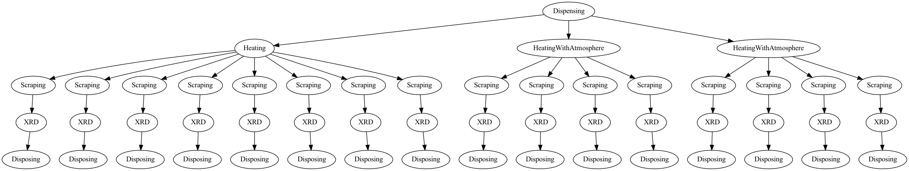

.. _quickstart:

============
Quickstart
============

Basically, you need to define an experiment first. Then you will add ``sample``
to the experiment. Each sample will have some operations and finally, you can
generate the input file, which can be submitted to the Alab Management software
directly.

.. code-block:: python

      from alab_experiment_helper import Experiment

      experiment = Experiment("test_experiment")

      # Sample Declaration
      samples = [experiment.add_sample(name="sample_" + str(i)) for i in range(16)]
      sample_group_1 = samples[0:8]
      sample_group_2 = samples[8:12]
      sample_group_3 = samples[12:16]

      # Task Declaration
      dispensing(samples, input_file_path="example.csv")

      heating(sample_group_1, [[300, 60], [300, 600]])
      heating_with_atmosphere(sample_group_2, [[300, 60], [300, 600]], atmosphere="Ar")
      heating_with_atmosphere(sample_group_3, [[300, 60], [300, 600]], atmosphere="N2")

      for sample in samples:
          scraping(sample, duration_min=6, ball_number=8)
          xrd(sample, schema="fast_10min")
          disposing(sample)

      # Generate the input file with JSON format
      experiment.generate_input_file("test.json", "json")

The task generated is something like this:

More details
------------
The whole package tries to make the task generation a declarative process, where each
script should describe one ``Experiment``. In the Alab Workflow System, an experiment
is a list of samples to be made, where a sequence of tasks will be operated on the
samples.

The input file can be divided into two parts: ``Sample Declaration`` and ``Task
Declaration``.

At the top of each script, you should declare an ``Experiment`` object, like this

.. code-block:: python

      from alab_experiment_helper import Experiment

      # The name can be any names you like. But a clear and unique name will
      # help you find the information you want more easily later.
      experiment = Experiment(name="test_experiment")

Then, you can add samples to the experiment, which is the ``Sample Declaration`` part

.. code-block:: python

      # the name of samples should be unique, which you will refer to it
      # later in the task definition.
      samples = [experiment.add_sample(name="sample_" + str(i)) for i in range(16)]

After declaring the samples, you need to specify which kind of tasks you want to do on
each sample. The task will be conducted in order. The package will automatically record
the order of the tasks based on the order of declaration. Each task is a function that
receives one or a list of samples as well as many task specified parameters.

.. note::

    The available tasks can be found in the `Tasks Overview <tasks.html>`_ section.

.. code-block:: python

      from alab_experiment_helper.tasks import *

      dispensing(samples, input_file_path="example.csv")

Generating the input file
++++++++++++++++++++++++++
Finally, you can choose to generate the input file and save it to a certain path. Currently,
we support two formats: ``json`` and ``yaml``. Both files can be submitted to the workflow
software without any problem.

.. code-block:: python

      # first argument: the path to save the input file
      # second argument: the format of the input file, can be either ``json`` or ``yaml``
      experiment.generate_input_file("test.json", "json")

Visualizing the experiment graph
++++++++++++++++++++++++++++++++

As we talked about before, the tasks have orders. Internally, we represent the tasks as
a directed graph. The graph can be visualized by using the ``visualize`` function of
``Experiment`` object.

.. note::

    Before you use this function, you need to install ``graphviz``, which you can
    find useful information in the `graphviz website <http://www.graphviz.org/>`_.

.. code-block:: python

      # The first argument is the path to save the graph image
      # The second argument is the format of the image, can be
      # ``png``, ``svg``, ``jpg`` or ``pdf``
      experiment.visualize("figure.png", "png")
